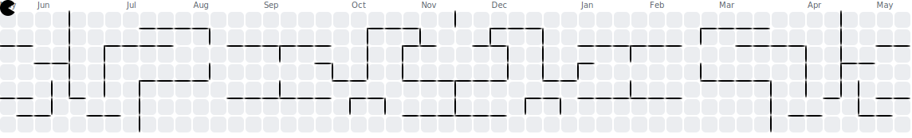

  

<h1 align="center">Hi there! I'm Aditya 👋🏼</h1>

---

## 🙋 About Me

  Hi, I'm Aditya Gaudy Mardiono. 
  I'm student at SMKN 1 Purwosari, a curious learner and passionate about tech, especially in web and mobile development. 
  Still on my journey, I'm always open to learn, grow, and connect with others.  
  <strong>Let's build something awesome together!</strong> 🚀

---

## 💻 Languages & Tools

  
  
  
  
  
  
  
  
  
  

---

## 📊 Stats

  
  
  

---

## 💬 Let's Talk

  
  
  

---

## 🕹 Play with Me

###

---

## 🎧 Currently Vibing to

  

---

  

